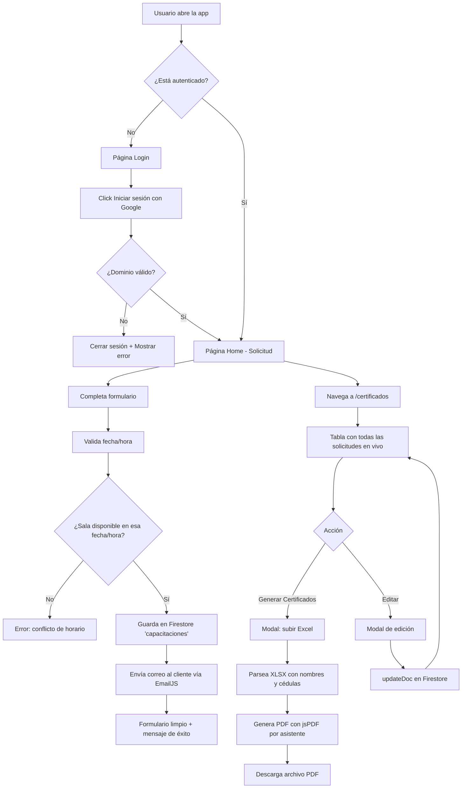
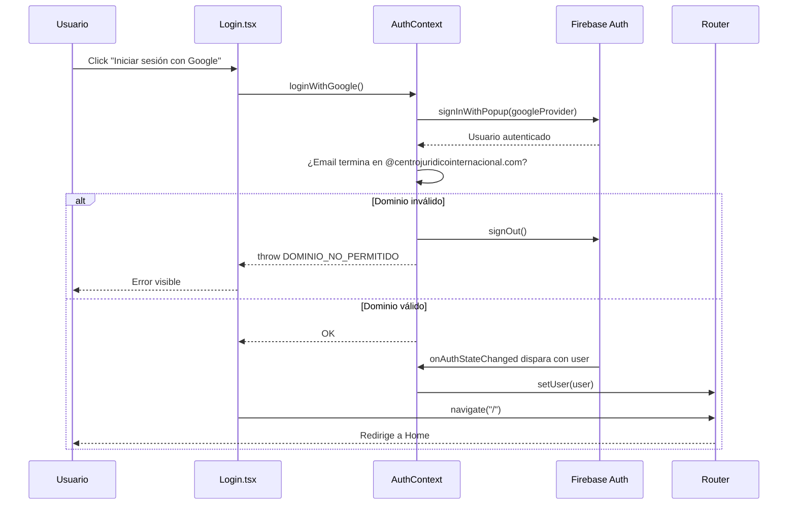
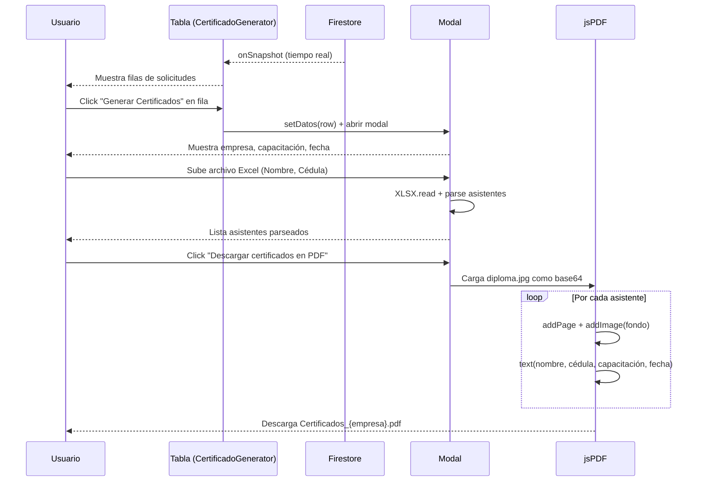

# Centro Jurídico Internacional — Plataforma de Capacitaciones

Aplicación web interna del **Centro Jurídico Internacional** para gestionar capacitaciones empresariales: registro de solicitudes, asignación de salas de Google Meet, notificación por correo a clientes y generación de certificados en PDF a partir de un listado de asistentes.

> **Acceso restringido** al dominio corporativo `@centrojuridicointernacional.com` vía Google Sign-In.

## Entornos

| Entorno | URL |
|---------|-----|
| Producción (dominio personalizado) | https://certificados.centrojuridicointernacional.co |
| Producción (Firebase Hosting) | https://certificados-cji.web.app |
| Local (desarrollo) | http://localhost:5173 |

**Proyecto Firebase:** `certificados-cji` · Plan Spark · Región Firestore `nam5` · Propietario `desarrollo1@centrojuridicointernacional.com`.

---

## Tabla de contenidos

- [Características](#características)
- [Stack tecnológico](#stack-tecnológico)
- [Diagrama de flujo general](#diagrama-de-flujo-general)
- [Estructura del proyecto](#estructura-del-proyecto)
- [Rutas y permisos](#rutas-y-permisos)
- [Módulos principales](#módulos-principales)
- [Modelo de datos (Firestore)](#modelo-de-datos-firestore)
- [Flujo de autenticación](#flujo-de-autenticación)
- [Flujo de generación de certificados](#flujo-de-generación-de-certificados)
- [Configuración local](#configuración-local)
- [Variables de entorno](#variables-de-entorno)
- [Scripts disponibles](#scripts-disponibles)
- [Despliegue a Firebase](#despliegue-a-firebase)
- [Reglas de seguridad de Firestore](#reglas-de-seguridad-de-firestore)
- [Optimizaciones aplicadas](#optimizaciones-aplicadas)
- [Troubleshooting](#troubleshooting)

---

## Características

- 🔐 **Autenticación con Google** restringida al dominio corporativo.
- 📝 **Formulario de solicitud de capacitación** con validación de fechas (domingos y festivos colombianos no disponibles).
- 📅 **Asignación automática de sala de Google Meet** según el jurídico que ingresa (59 salas precargadas).
- ✏️ **Sala de Meet editable** antes de enviar la solicitud por si se necesita un link distinto.
- 📧 **Envío de correo al cliente** con los datos de la reunión usando EmailJS.
- 📋 **Tabla de solicitudes registradas** con actualización en tiempo real (Firestore `onSnapshot`).
- 🎓 **Generación de certificados en PDF** a partir de un archivo Excel de asistentes, usando una plantilla JPG como fondo.
- ✂️ **Edición in-situ** de solicitudes desde la tabla sin perder trazabilidad del jurídico que la creó.
- 🛡️ **Panel de administración** (solo para admins autorizados) para ver, editar y eliminar todos los registros.
- 🌙 **Dark mode automático** según preferencia del sistema.
- 📱 **Responsive** con breakpoints a 1100px y 640px.

---

## Stack tecnológico

| Capa | Tecnología |
|------|-----------|
| UI / Frontend | React 19 + TypeScript |
| Bundler / Dev server | Vite 8 |
| Routing | React Router v7 |
| Backend as a Service | Firebase (Auth + Firestore) |
| Correos transaccionales | EmailJS |
| Lectura de Excel | SheetJS (`xlsx`) |
| Generación de PDF | jsPDF |
| Estilos | CSS Modules por componente (sin framework) |
| Compilador | React Compiler (vía plugin Babel) |
| Hosting | Firebase Hosting |
| DNS del dominio | Bluehost (CNAME → `certificados-cji.web.app`) |

---

## Diagrama de flujo general



---

## Estructura del proyecto

```
certificados/
├── public/                       # Assets estáticos servidos tal cual
├── src/
│   ├── assets/                   # Imágenes (logo, diploma, fondo login, hero)
│   ├── components/
│   │   ├── AdminRoute.tsx        # Guard de rutas solo para admins
│   │   ├── CertificadoGenerator.tsx  # Componente principal de certificados
│   │   ├── CertificadoGenerator.css
│   │   ├── ErrorBoundary.tsx
│   │   └── PrivateRoute.tsx      # Guard de rutas autenticadas
│   ├── context/
│   │   └── AuthContext.tsx       # Provider global de autenticación
│   ├── constants/
│   │   └── admins.ts             # Lista de correos con acceso admin
│   ├── layouts/
│   │   ├── MainLayout.tsx        # Header + navegación + contenedor
│   │   └── MainLayout.css
│   ├── pages/
│   │   ├── Home.tsx              # Formulario de solicitud de capacitación
│   │   ├── Login.tsx             # Login con Google
│   │   ├── Dashboard.tsx         # (placeholder)
│   │   ├── AdminPanel.tsx        # Administración de todos los registros
│   │   └── Certificados.tsx      # Wrapper que monta CertificadoGenerator
│   ├── firebase.ts               # Inicialización de Firebase
│   ├── App.tsx                   # Rutas + Suspense + lazy loading
│   ├── main.tsx                  # Bootstrap React + BrowserRouter
│   └── index.css                 # Estilos globales
├── .env                          # Variables de entorno (no versionado)
├── .firebaserc                   # Apunta al proyecto Firebase (certificados-cji)
├── firebase.json                 # Config de Hosting y Firestore
├── firestore.rules               # Reglas de seguridad de Firestore
├── firestore.indexes.json        # Índices de Firestore
├── index.html
├── package.json
├── tsconfig.json
└── vite.config.ts
```

---

## Rutas y permisos

| Ruta | Página | Protección | Descripción |
|------|--------|-----------|-------------|
| `/login` | `Login.tsx` | Pública | Inicio de sesión con Google |
| `/` | `Home.tsx` | `PrivateRoute` | Formulario de solicitud de capacitación |
| `/dashboard` | `Dashboard.tsx` | `PrivateRoute` | Placeholder |
| `/certificados` | `Certificados.tsx` | `PrivateRoute` | Tabla de solicitudes + generación de PDF |

> Todas las rutas excepto `/login` requieren sesión activa. Si no hay usuario, redirige a `/login`.
> `AdminRoute` existe pero `/admin` aún no está cableada en `App.tsx` — para habilitarla, añadir la ruta envuelta en `<AdminRoute>`.

---

## Módulos principales

### 1. Login (`pages/Login.tsx`)
- Botón único de Google Sign-In.
- Valida que el correo termine en `@centrojuridicointernacional.com`; si no, cierra sesión inmediatamente y muestra error.
- Usa `fondoinicio.jpg` como background.

### 2. Formulario de solicitud (`pages/Home.tsx`)
- Captura: empresa, NIT, correo del cliente, fecha, hora, tipo de capacitación.
- **Valida** que la fecha no sea domingo ni festivo colombiano (lista hardcoded 2025–2027).
- **Asigna sala de Meet** automáticamente según el email del usuario logueado (diccionario `SALAS_MEET`).
- Permite **editar manualmente** el link de Meet antes de enviar.
- **Verifica disponibilidad**: no permite dos reuniones en la misma sala, fecha y hora.
- Guarda en Firestore `capacitaciones` y envía correo al cliente via EmailJS.

### 3. Generador de certificados (`components/CertificadoGenerator.tsx`)
- Se suscribe en tiempo real a la colección `capacitaciones` con `onSnapshot`.
- Muestra una **tabla de solicitudes registradas** con columnas: Empresa, N.I.T., Correo, Capacitación, Jurídico, Fecha, Hora.
- Cada fila tiene dos acciones:
  - **Generar Certificados** → abre un modal pre-llenado con los datos del registro. El usuario sube un Excel `.xlsx` con columnas `Nombre | Cédula` y se genera un PDF multipágina con un certificado por asistente.
  - **Editar** → abre un modal para modificar empresa, NIT, correo, capacitación, fecha u hora. Guarda con `updateDoc` (el `userEmail` / jurídico se preserva).
- PDF generado con **jsPDF** directamente (sin DOM oculto ni `html2canvas`), usando `diploma.jpg` como fondo y superponiendo texto.

### 4. Panel de administración (`pages/AdminPanel.tsx`)
- Lista completa de registros con búsqueda por texto y filtro por mes.
- Modal de detalle con edición de todos los campos (incluyendo `linkMeet`) y eliminación.
- **Nota**: este componente existe pero la ruta `/admin` no está activa en `App.tsx`.

---

## Modelo de datos (Firestore)

### Colección: `capacitaciones`

Cada documento representa una solicitud de capacitación registrada desde el formulario Home.

```ts
{
  nombre: string;          // Nombre de la empresa
  nit: string;             // NIT de la empresa
  correo: string;          // Correo del cliente
  fecha: string;           // "YYYY-MM-DD"
  hora: string;            // "HH:mm" (24h)
  capacitacion: string;    // Tipo de capacitación (del enum CAPACITACIONES)
  linkMeet: string;        // URL de la sala de Google Meet
  userId: string | null;   // UID del jurídico que creó la solicitud
  userEmail: string | null;// Email del jurídico (usado para columna "Jurídico")
  creadoEn: Timestamp;     // Server timestamp
}
```

**Esta es la única colección**. No hay colecciones paralelas de "certificados generados" — la tabla de `CertificadoGenerator` lee directamente de `capacitaciones` (que es la fuente de verdad).

### Índices

Los índices compuestos están versionados en [`firestore.indexes.json`](firestore.indexes.json) y se despliegan con `firebase deploy --only firestore:indexes`.

| Campos | Uso |
|--------|-----|
| `nit` ASC + `fecha` DESC | Consulta usada por la **zona de afiliados** (`where('nit', 'in', [...])` + `orderBy('fecha', 'desc')`) para mostrarle a cada cliente sus certificados al ingresar su NIT. |

### Consumidores externos de esta base de datos

Esta colección la lee también el proyecto **Zona de Afiliados** (repositorio separado en `pagina web zona de afiliados`), que se conecta como app Firebase secundaria a `certificados-cji` con auth anónima. Cualquier cambio en el esquema de los documentos debe coordinarse con ese proyecto.

---

## Flujo de autenticación



---

## Flujo de generación de certificados



---

## Configuración local

### Requisitos

- Node.js 20+
- npm
- [Firebase CLI](https://firebase.google.com/docs/cli) (`npm install -g firebase-tools`) — solo necesario para desplegar
- Acceso al proyecto Firebase `certificados-cji` (o uno propio con Authentication Google y Firestore habilitados)
- Cuenta de EmailJS con una plantilla configurada

### Instalación

```bash
git clone <repo>
cd certificados
npm install
cp .env.example .env   # crear y completar variables (ver siguiente sección)
npm run dev
```

Abrir [http://localhost:5173](http://localhost:5173).

---

## Variables de entorno

Crear un archivo `.env` en la raíz con:

```env
# Firebase — proyecto certificados-cji
VITE_FIREBASE_API_KEY=...
VITE_FIREBASE_AUTH_DOMAIN=...
VITE_FIREBASE_PROJECT_ID=...
VITE_FIREBASE_STORAGE_BUCKET=...
VITE_FIREBASE_MESSAGING_SENDER_ID=...
VITE_FIREBASE_APP_ID=...
VITE_FIREBASE_MEASUREMENT_ID=...

# EmailJS
VITE_EMAILJS_SERVICE_ID=...
VITE_EMAILJS_TEMPLATE_ID=...
VITE_EMAILJS_PUBLIC_KEY=...
```

> ⚠️ El `.env` **NO debe versionarse**. Añadirlo al `.gitignore`.

---

## Scripts disponibles

| Comando | Descripción |
|---------|-------------|
| `npm run dev` | Levanta el servidor de desarrollo en `http://localhost:5173` con HMR. |
| `npm run build` | Compila TypeScript (`tsc -b`) y genera el bundle de producción en `dist/`. |
| `npm run preview` | Sirve el build de producción localmente para verificación. |
| `npm run lint` | Ejecuta ESLint sobre todo el proyecto. |

---

## Despliegue a Firebase

El proyecto se despliega a **Firebase Hosting** del proyecto `certificados-cji`.

### Requisitos previos

- Firebase CLI instalado: `npm install -g firebase-tools`
- Estar logueado con una cuenta con permisos en el proyecto: `firebase login`
- Proyecto activo apuntando a `certificados-cji`: `firebase use certificados-cji`

### Comandos

```bash
# 1. Compilar la app
npm run build

# 2. Desplegar todo (Hosting + reglas de Firestore)
firebase deploy

# Variantes:
firebase deploy --only hosting          # Solo el sitio
firebase deploy --only firestore:rules  # Solo las reglas
```

Al terminar, el deploy responde con la URL pública. El dominio personalizado `certificados.centrojuridicointernacional.co` está configurado vía CNAME en Bluehost apuntando a `certificados-cji.web.app`.

### Dominios autorizados de Authentication

Si se agrega un nuevo dominio donde se sirva la app, debe añadirse manualmente en:

`Firebase Console → Authentication → Configuración → Dominios autorizados`

Sin esto, el botón de Google Sign-In fallará con `auth/unauthorized-domain`.

---

## Reglas de seguridad de Firestore

Las reglas están definidas en [`firestore.rules`](firestore.rules) y se versionan junto al código. Política actual: cualquier usuario autenticado puede leer y escribir la colección `capacitaciones`. El filtro por dominio corporativo lo aplica el frontend en [`AuthContext`](src/context/AuthContext.tsx).

```js
rules_version = '2';
service cloud.firestore {
  match /databases/{database}/documents {
    match /capacitaciones/{document} {
      allow read, write: if request.auth != null;
    }
  }
}
```

Para modificar y desplegar:

```bash
# editar firestore.rules
firebase deploy --only firestore:rules
```

---

## Optimizaciones aplicadas

- ✅ **Lazy loading de rutas** con `React.lazy` + `Suspense` en `App.tsx`. El bundle inicial del Login no incluye `xlsx`, `jspdf` ni el código del generador de certificados.
- ✅ **Búsqueda en memoria** en `CertificadoGenerator`: los botones de cada fila usan el estado local ya sincronizado por `onSnapshot` en lugar de hacer un `getDocs` adicional a Firestore.
- ✅ **Suscripción única** a `capacitaciones` con `onSnapshot` — la tabla se actualiza sola cuando se crea o edita un registro (desde cualquier pestaña).
- ✅ **Responsive con breakpoints intermedios** (1100px y 640px): los botones se apilan verticalmente en tablets y el modal/formulario adapta su layout.
- ✅ **`translate="no"`** en la tabla para evitar que Chrome traduzca automáticamente palabras como "NIT" → "Liendre".
- ⚠️ **Pendiente**: `diploma.jpg` (2.5 MB) podría optimizarse a ~500 KB para acelerar aún más la primera generación de certificados.

---

## Troubleshooting

### `firebase deploy` apunta al proyecto equivocado
La CLI guarda el proyecto activo en una caché global que tiene prioridad sobre `.firebaserc`. Fijarlo explícitamente:

```bash
firebase use certificados-cji
firebase use     # confirma cuál está activo
```

### Login falla con `auth/unauthorized-domain`
El dominio desde el que se sirve la app no está en la lista de **Dominios autorizados** de Authentication. Agregarlo en:
`Firebase Console → Authentication → Configuración → Dominios autorizados`.

### `Sitio no encontrado` en el dominio personalizado tras agregarlo
Aunque el estado en Firebase Hosting diga "Conectado", a veces Firebase tarda en propagar la asociación a sus edge servers. Solución rápida: hacer un deploy adicional para forzar la actualización:

```bash
firebase deploy --only hosting
```

### El CNAME se cambió pero Firebase sigue viendo el valor anterior
La verificación de Firebase usa los DNS de Google, que respetan el TTL del registro CNAME. Si el TTL es alto (ej. 14400 = 4 h) puede tardar. Bajar el TTL temporalmente a `300` en Bluehost acelera la siguiente verificación.

### Permisos denegados al leer Firestore en producción
Verificar que [`firestore.rules`](firestore.rules) está desplegado en el proyecto activo:

```bash
firebase deploy --only firestore:rules
```

Si el usuario está autenticado pero las lecturas fallan, abrir Firebase Console → Firestore → Reglas y confirmar que la versión publicada coincide con la del repo.

### `FirebaseError: The query requires an index`
La consulta combina `where()` y `orderBy()` en campos distintos, lo que exige un **índice compuesto**. Dos opciones:

1. **Recomendado**: agregarlo a [`firestore.indexes.json`](firestore.indexes.json) y desplegar:
   ```bash
   firebase deploy --only firestore:indexes
   ```
2. **Rápido**: abrir el link que Firebase muestra en el error (te lleva a la consola con el índice prellenado).

Después de desplegar, el índice tarda **2–10 minutos** en compilar. El estado se ve en Firebase Console → Firestore → Índices.

---

## Licencia

Uso interno — Centro Jurídico Internacional.
