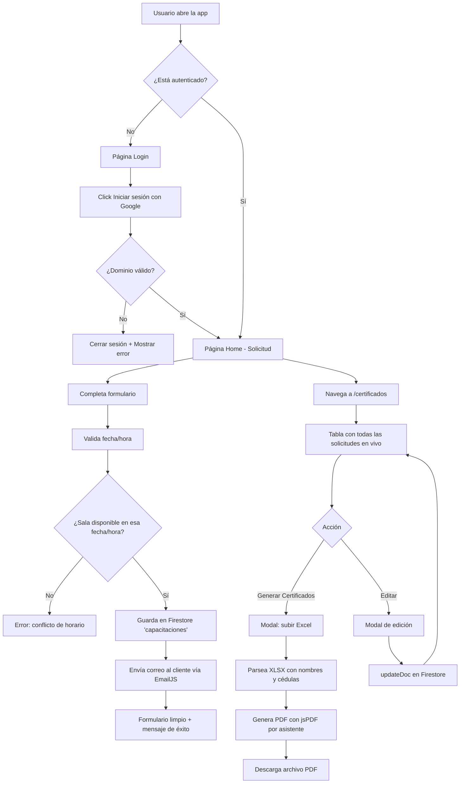
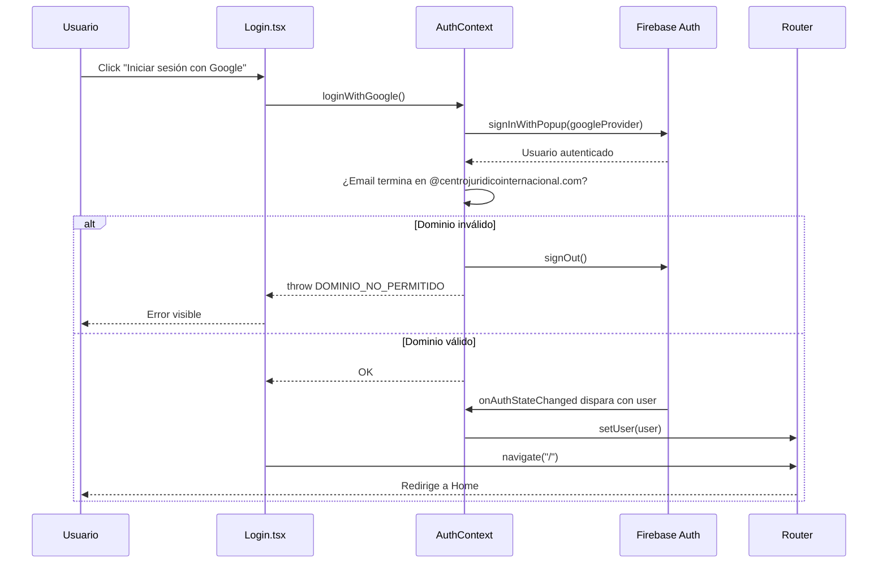
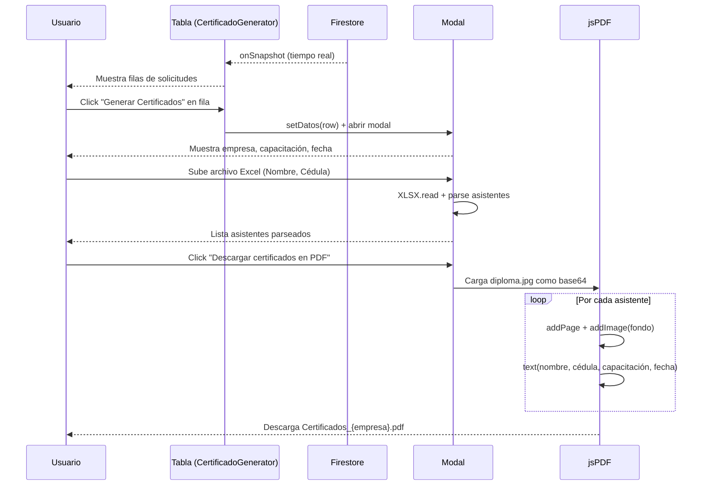

# Centro Jurídico Internacional — Plataforma de Capacitaciones

Aplicación web interna del **Centro Jurídico Internacional** para gestionar capacitaciones empresariales: registro de solicitudes, asignación de salas de Google Meet, notificación por correo a clientes y generación de certificados en PDF a partir de un listado de asistentes.

> **Acceso restringido** al dominio corporativo `@centrojuridicointernacional.com` vía Google Sign-In.

---

## Tabla de contenidos

- [Características](#características)
- [Stack tecnológico](#stack-tecnológico)
- [Diagrama de flujo general](#diagrama-de-flujo-general)
- [Estructura del proyecto](#estructura-del-proyecto)
- [Rutas y permisos](#rutas-y-permisos)
- [Módulos principales](#módulos-principales)
- [Modelo de datos (Firestore)](#modelo-de-datos-firestore)
- [Flujo de autenticación](#flujo-de-autenticación)
- [Flujo de generación de certificados](#flujo-de-generación-de-certificados)
- [Configuración local](#configuración-local)
- [Variables de entorno](#variables-de-entorno)
- [Scripts disponibles](#scripts-disponibles)
- [Optimizaciones aplicadas](#optimizaciones-aplicadas)

---

## Características

- 🔐 **Autenticación con Google** restringida al dominio corporativo.
- 📝 **Formulario de solicitud de capacitación** con validación de fechas (domingos y festivos colombianos no disponibles).
- 📅 **Asignación automática de sala de Google Meet** según el jurídico que ingresa (59 salas precargadas).
- ✏️ **Sala de Meet editable** antes de enviar la solicitud por si se necesita un link distinto.
- 📧 **Envío de correo al cliente** con los datos de la reunión usando EmailJS.
- 📋 **Tabla de solicitudes registradas** con actualización en tiempo real (Firestore `onSnapshot`).
- 🎓 **Generación de certificados en PDF** a partir de un archivo Excel de asistentes, usando una plantilla JPG como fondo.
- ✂️ **Edición in-situ** de solicitudes desde la tabla sin perder trazabilidad del jurídico que la creó.
- 🛡️ **Panel de administración** (solo para admins autorizados) para ver, editar y eliminar todos los registros.
- 🌙 **Dark mode automático** según preferencia del sistema.
- 📱 **Responsive** con breakpoints a 1100px y 640px.

---

## Stack tecnológico

| Capa | Tecnología |
|------|-----------|
| UI / Frontend | React 19 + TypeScript |
| Bundler / Dev server | Vite 8 |
| Routing | React Router v7 |
| Backend as a Service | Firebase (Auth + Firestore) |
| Correos transaccionales | EmailJS |
| Lectura de Excel | SheetJS (`xlsx`) |
| Generación de PDF | jsPDF |
| Estilos | CSS Modules por componente (sin framework) |
| Compilador | React Compiler (vía plugin Babel) |

---

## Diagrama de flujo general



---

## Estructura del proyecto

```
certificados/
├── public/                       # Assets estáticos servidos tal cual
├── src/
│   ├── assets/                   # Imágenes (logo, diploma, fondo login, hero)
│   ├── components/
│   │   ├── AdminRoute.tsx        # Guard de rutas solo para admins
│   │   ├── CertificadoGenerator.tsx  # Componente principal de certificados
│   │   ├── CertificadoGenerator.css
│   │   ├── ErrorBoundary.tsx
│   │   └── PrivateRoute.tsx      # Guard de rutas autenticadas
│   ├── context/
│   │   └── AuthContext.tsx       # Provider global de autenticación
│   ├── constants/
│   │   └── admins.ts             # Lista de correos con acceso admin
│   ├── layouts/
│   │   ├── MainLayout.tsx        # Header + navegación + contenedor
│   │   └── MainLayout.css
│   ├── pages/
│   │   ├── Home.tsx              # Formulario de solicitud de capacitación
│   │   ├── Login.tsx             # Login con Google
│   │   ├── Dashboard.tsx         # (placeholder)
│   │   ├── AdminPanel.tsx        # Administración de todos los registros
│   │   └── Certificados.tsx      # Wrapper que monta CertificadoGenerator
│   ├── firebase.ts               # Inicialización de Firebase
│   ├── App.tsx                   # Rutas + Suspense + lazy loading
│   ├── main.tsx                  # Bootstrap React + BrowserRouter
│   └── index.css                 # Estilos globales
├── .env                          # Variables de entorno (no versionado)
├── index.html
├── package.json
├── tsconfig.json
└── vite.config.ts
```

---

## Rutas y permisos

| Ruta | Página | Protección | Descripción |
|------|--------|-----------|-------------|
| `/login` | `Login.tsx` | Pública | Inicio de sesión con Google |
| `/` | `Home.tsx` | `PrivateRoute` | Formulario de solicitud de capacitación |
| `/dashboard` | `Dashboard.tsx` | `PrivateRoute` | Placeholder |
| `/certificados` | `Certificados.tsx` | `PrivateRoute` | Tabla de solicitudes + generación de PDF |

> Todas las rutas excepto `/login` requieren sesión activa. Si no hay usuario, redirige a `/login`.
> `AdminRoute` existe pero `/admin` aún no está cableada en `App.tsx` — para habilitarla, añadir la ruta envuelta en `<AdminRoute>`.

---

## Módulos principales

### 1. Login (`pages/Login.tsx`)
- Botón único de Google Sign-In.
- Valida que el correo termine en `@centrojuridicointernacional.com`; si no, cierra sesión inmediatamente y muestra error.
- Usa `fondoinicio.jpg` como background.

### 2. Formulario de solicitud (`pages/Home.tsx`)
- Captura: empresa, NIT, correo del cliente, fecha, hora, tipo de capacitación.
- **Valida** que la fecha no sea domingo ni festivo colombiano (lista hardcoded 2025–2027).
- **Asigna sala de Meet** automáticamente según el email del usuario logueado (diccionario `SALAS_MEET`).
- Permite **editar manualmente** el link de Meet antes de enviar.
- **Verifica disponibilidad**: no permite dos reuniones en la misma sala, fecha y hora.
- Guarda en Firestore `capacitaciones` y envía correo al cliente via EmailJS.

### 3. Generador de certificados (`components/CertificadoGenerator.tsx`)
- Se suscribe en tiempo real a la colección `capacitaciones` con `onSnapshot`.
- Muestra una **tabla de solicitudes registradas** con columnas: Empresa, N.I.T., Correo, Capacitación, Jurídico, Fecha, Hora.
- Cada fila tiene dos acciones:
  - **Generar Certificados** → abre un modal pre-llenado con los datos del registro. El usuario sube un Excel `.xlsx` con columnas `Nombre | Cédula` y se genera un PDF multipágina con un certificado por asistente.
  - **Editar** → abre un modal para modificar empresa, NIT, correo, capacitación, fecha u hora. Guarda con `updateDoc` (el `userEmail` / jurídico se preserva).
- PDF generado con **jsPDF** directamente (sin DOM oculto ni `html2canvas`), usando `diploma.jpg` como fondo y superponiendo texto.

### 4. Panel de administración (`pages/AdminPanel.tsx`)
- Lista completa de registros con búsqueda por texto y filtro por mes.
- Modal de detalle con edición de todos los campos (incluyendo `linkMeet`) y eliminación.
- **Nota**: este componente existe pero la ruta `/admin` no está activa en `App.tsx`.

---

## Modelo de datos (Firestore)

### Colección: `capacitaciones`

Cada documento representa una solicitud de capacitación registrada desde el formulario Home.

```ts
{
  nombre: string;          // Nombre de la empresa
  nit: string;             // NIT de la empresa
  correo: string;          // Correo del cliente
  fecha: string;           // "YYYY-MM-DD"
  hora: string;            // "HH:mm" (24h)
  capacitacion: string;    // Tipo de capacitación (del enum CAPACITACIONES)
  linkMeet: string;        // URL de la sala de Google Meet
  userId: string | null;   // UID del jurídico que creó la solicitud
  userEmail: string | null;// Email del jurídico (usado para columna "Jurídico")
  creadoEn: Timestamp;     // Server timestamp
}
```

**Esta es la única colección**. No hay colecciones paralelas de "certificados generados" — la tabla de `CertificadoGenerator` lee directamente de `capacitaciones` (que es la fuente de verdad).

---

## Flujo de autenticación



---

## Flujo de generación de certificados



---

## Configuración local

### Requisitos

- Node.js 20+
- npm o pnpm
- Cuenta de Firebase con Authentication (Google) y Firestore habilitados
- Cuenta de EmailJS con una plantilla configurada

### Instalación

```bash
git clone <repo>
cd certificados
npm install
cp .env.example .env   # crear y completar variables (ver siguiente sección)
npm run dev
```

Abrir [http://localhost:5173](http://localhost:5173).

---

## Variables de entorno

Crear un archivo `.env` en la raíz con:

```env
# Firebase
VITE_FIREBASE_API_KEY=...
VITE_FIREBASE_AUTH_DOMAIN=...
VITE_FIREBASE_PROJECT_ID=...
VITE_FIREBASE_STORAGE_BUCKET=...
VITE_FIREBASE_MESSAGING_SENDER_ID=...
VITE_FIREBASE_APP_ID=...

# EmailJS
VITE_EMAILJS_SERVICE_ID=...
VITE_EMAILJS_TEMPLATE_ID=...
VITE_EMAILJS_PUBLIC_KEY=...
```

> ⚠️ El `.env` **NO debe versionarse**. Añadirlo al `.gitignore`.

---

## Scripts disponibles

| Comando | Descripción |
|---------|-------------|
| `npm run dev` | Levanta el servidor de desarrollo en `http://localhost:5173` con HMR. |
| `npm run build` | Compila TypeScript (`tsc -b`) y genera el bundle de producción en `dist/`. |
| `npm run preview` | Sirve el build de producción localmente para verificación. |
| `npm run lint` | Ejecuta ESLint sobre todo el proyecto. |

---

## Optimizaciones aplicadas

- ✅ **Lazy loading de rutas** con `React.lazy` + `Suspense` en `App.tsx`. El bundle inicial del Login no incluye `xlsx`, `jspdf` ni el código del generador de certificados.
- ✅ **Búsqueda en memoria** en `CertificadoGenerator`: los botones de cada fila usan el estado local ya sincronizado por `onSnapshot` en lugar de hacer un `getDocs` adicional a Firestore.
- ✅ **Suscripción única** a `capacitaciones` con `onSnapshot` — la tabla se actualiza sola cuando se crea o edita un registro (desde cualquier pestaña).
- ✅ **Responsive con breakpoints intermedios** (1100px y 640px): los botones se apilan verticalmente en tablets y el modal/formulario adapta su layout.
- ✅ **`translate="no"`** en la tabla para evitar que Chrome traduzca automáticamente palabras como "NIT" → "Liendre".
- ⚠️ **Pendiente**: `diploma.jpg` (2.5 MB) podría optimizarse a ~500 KB para acelerar aún más la primera generación de certificados.

---

## Licencia

Uso interno — Centro Jurídico Internacional.
